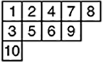

# Преобразование RSK на множествах перестановок
### Альт.экзамен КиТГ-2022
#### _Участники:_
* Волосевич Артем [@github/Miryz21](https://github.com/Miryz21)
* Кашуба Данил [@github/dann1erel](https://github.com/dann1erel)
* Шлом Илья [@github/ilya-shlom](https://github.com/ilya-shlom)

_(гр.1306)_

## Основные понятия
* **Перестановка W** – упорядоченный набор без повторений чисел {1, 2, ..., n}; число n – это **Длина (или мощность) перестановки**
  * **Reverse permutation (W^R)** – запись перестановки в обратном порядке *(Пример: 624135 → 531426)*
  * **Inverse permutation (W^(-1))** – замена индексов элементов на соответствующие значения *(Пример: 624135 → 425361)*
  * **Complement permutation (W^c)** – дополнение элементов перестановки до n+1 (complement permutation) *(Пример: 624135 → 153642)*
* **Диаграмма Юнга** – Набор ячеек, выровненных по левой границе (верхней во французской нотации,
нижней в английской), в котором длина каждой следующей строки меньше или равна предыдущей
* **Таблица Юнга** – такая диаграмма Юнга, в которой каждая ячейка заполнена символом
какого-либо алфавита (как правило, натуральными числами). Пример:

* **Стандартная таблица Юнга** – таблица, в которой числа возрастают в каждой строчке и в каждом столбце
* И, наконец, **RSK** – функция от перестановки W, задающая для нее пару таблиц Юнга – таблица вставки P
и таблица записи Q
  * **Таблица вставки P** – таблица Юнга, в которую записываются значения из перестановки W по
алгоритму Шенстеда
  * **Таблица записи Q** – Таблица Юнга, в которой записывается появление каждой новой
ячейки по мере заполнения таблицы вставки
## О репозитории
Файлы *tableaux.h и tableaux.h* содержат систему работы с перестановками и
таблицами Юнга; возможно создание случайной перестановки заданного размера, создание
пользовательской перестановки, для таблиц доступен алгоритм RSK по выбранной перестановке.
*main.cpp* – песочница для экспериментов над перестановками и таблицами :) Всё написано
на языке C++17.

*experiments.jpynb* – система для обработки полученных в cpp-файлах перестановок и таблиц.
возможно отслеживание необходимых данных, а также построение графиков для них.
Стек технологий - *Python, jupyter notebook, NumPy, matplotlib.*

